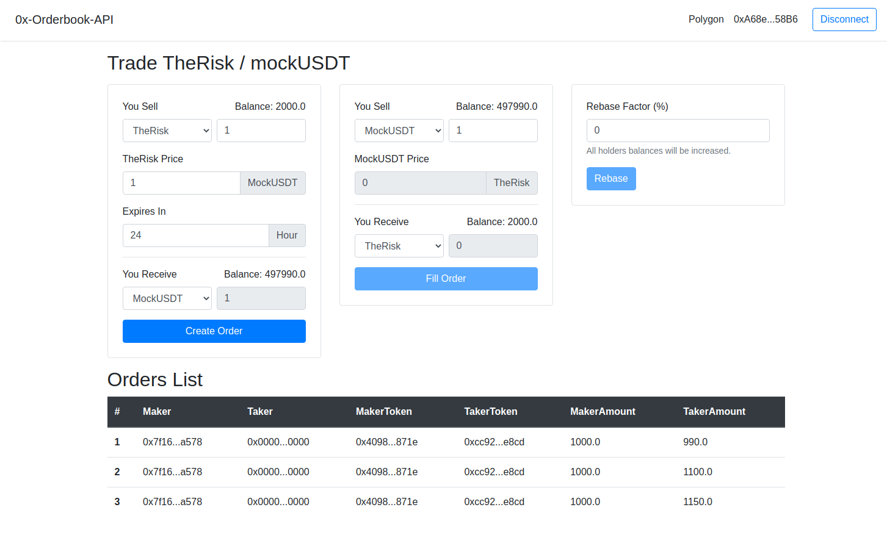

# 0x Orderbook API and Token with rebase functionality

This project demonstrates how to use `0x-orderbook-api` and `ERC20` token with `Rebase` functionality.

## Deploy and verify contract
Try running some of the following tasks:

```shell
npx hardhat clean
npx hardhat compile
npx hardhat test
npx hardhat --network polygon run scripts/deploy.js
```

```shell
npx hardhat --network polygon verify --contract "contracts/TheRisk.sol:TheRisk" 0x4098FFb7566b971f272529a36480748cAc55871e
npx hardhat --network polygon verify --contract "contracts/MockUSDT.sol:MockUSDT" 0xcC92a2E2FBF44dc82fBfb4a00ed09ACE1f19E8cD
```

## Deployed contract addresses (Polygon)
TheRisk: [0x4098FFb7566b971f272529a36480748cAc55871e](https://polygonscan.com/address/0x4098FFb7566b971f272529a36480748cAc55871e)

MockUSDT: [0xcC92a2E2FBF44dc82fBfb4a00ed09ACE1f19E8cD](https://polygonscan.com/address/0xcC92a2E2FBF44dc82fBfb4a00ed09ACE1f19E8cD)


## Front End (built with React)
